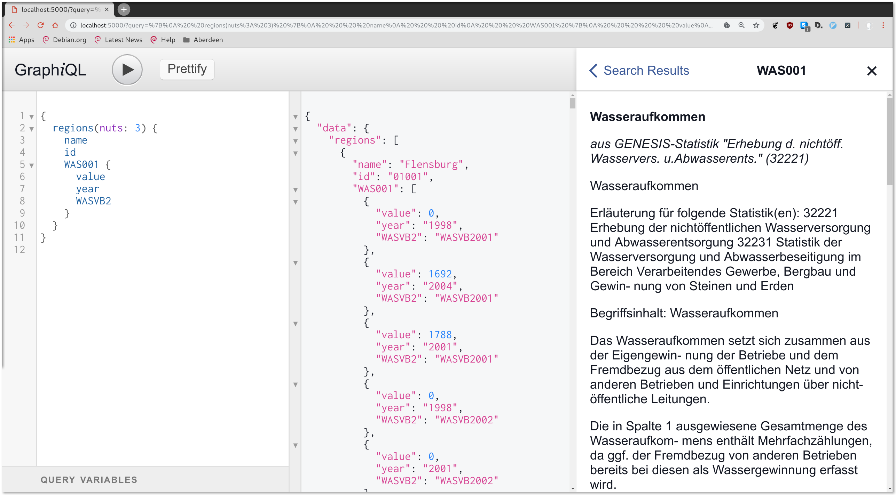

# datenguide-backend

A small [Flask](http://flask.pocoo.org/)-powered app that exposes an
[Elasticsearch](https://www.elastic.co/products/elasticsearch) index via a
[GraphQL](https://graphql.org/) API to make German official statistics data 
from *GENESIS* instances, such as 
[regionalstatistik.de](https://www.regionalstatistik.de), accessible for
*computers*.

This app provides the data for the [datengui.de website](https://datengui.de),
which makes German official statistics accessible for *humans*.

It also provides an interactive web frontend to play with the API and
explore the documentation:



## Live instance

You can find this app running live at https://api.genesapi.org.

## Setup

This app requires Python 3.

For installing requirements, use PIP:

    pip install -r requirements.txt

This app relies on an Elasticsearch index as a data source. There is a dedicated 
tool that can download data cubes from *GENESIS* instances and load them into an 
Elasticsearch index: [genesapi-cli](https://github.com/datenguide/genesapi-cli)

See below how to set up a small Elasticsearch cluster for local developement
(without using `genesapi-cli`).

## Run Flask app

The flask app has some settings in `settings.py` that can all be set via
environment variables.

Defaults:

```python
SCHEMA = 'data/schema.json'  # path to schema created with `genesapi-pipeline`
NAMES = 'data/names.json'    # path to names created with `genesapi-pipeline`
ELASTIC_HOST = 'localhost'
ELASTIC_PORT = 9200
ELASTIC_INDEX = 'genesapi'
```

For debug mode, run the app locally like this, assuming the names & schema
data is in `./data/` (there is some sample data in this repo):

    FLASK_DEBUG=1 FLASK_APP=app.py flask run

If the data is somewhere else, just add these env vars before:

    NAMES=/path/to/data/names.json SCHEMA=/path/to/data/schema.json FLASK_DEBUG=1 FLASK_APP=app.py flask run

For deployment, set the `DEBUG` variable to `False` and adjust the other 
environment variables.

## Setup Elasticsearch locally with sample data

Instead of using the [full data
pipeline](https://github.com/datenguide/genesapi-cli) that would be necessary
for loading a complete data dump from *GENESIS* into Elasticsearch, you can do
the short way in just importing some sample JSON *facts* as described below:

**Prerequisites**

1. Install [Elasticsearch](https://www.elastic.co/downloads/elasticsearch)
2. Install [Logstash](https://www.elastic.co/downloads/logstash)

*See individual websites for detailed installation instructions.*

It's usually the best idea for UNIX-based systems to just download the
executables and run them directly from somewhere in your local filesystem
(like, run the executable only for the time of developement) instead of
installing via package manager and running it as services.

Once an Elasticsearch cluster is running, and Logstash is installed, follow
these steps to load the sample data into the Elasticsearch index:

Download (aka checkout repo) & unpack all the content in this repo's `./data/`
folder:

    cd ./data/
    tar -xvf facts.tar.xz

Inside the `./data/` folder, run the following commands:

Create elasticsearch index template / mapping

    curl -H 'Content-Type: application/json' -XPUT http://localhost:9200/_template/genesis -d@template.json

Import the JSON file via Logstash, using the provided logstash config:

    cat facts.json | ~/path/to/logstash -f logstash.conf

That's it! Now you can launch the Flask app as described above and you should see a
nice `GraphiQL` interface in your browser.

## How to query data

[See documentation here](https://github.com/datenguide/datenguide/blob/master/docs/_api-docs/api_docs.md)
